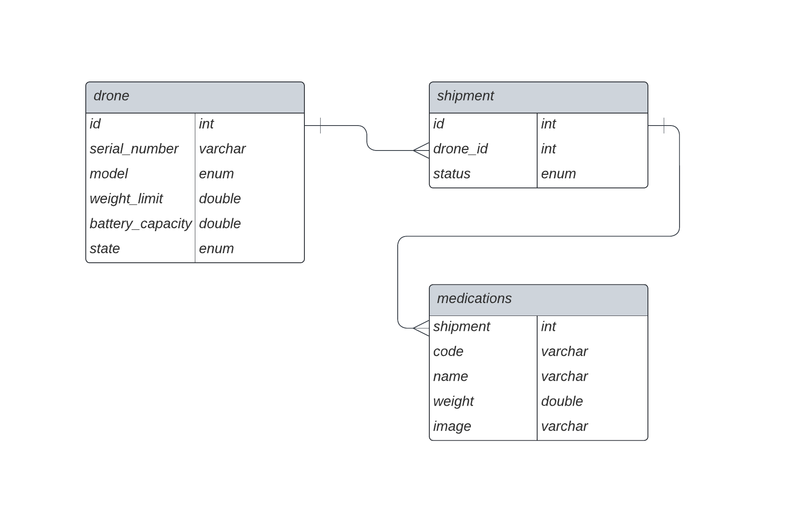

# Dispatch Controller #

This project demonstrates a drone based logistic management system for medicines. The `dispatch-controller-service`, exposes a
RESTful API to which clients can connect and perform required actions.

## Prerequisites ##
- OpenJDK 17+
- Maven 3.8.5.+

## Assumptions ##

- `Drone` will transport logistics in shipments. Once, a shipment is successfully delivered it can be re-used.
- `Serial Number` of a `Drone` is unique, hence there can be no two drones which has the same `Serial Number`.
- Since storing a raw-image is a database is expensive, `image` for the `Medication` will be provided as a URL.
- Once the battery-capacity of the `Drone` is less that 25% (0.25) the drone will go into `DRAINED` state.
- Application uses an in-memory database (H2).
- Postman collection to test the API can be found [here](docs/dispatch-controller.postman_collection.json).

With the above assumptions the DB design looks like following:


## Build, Test, and Run ##

### Build Application ###

Execute following command to build the application.
```shell
mvn clean install
```

### Test Application ###

Since, we are using maven when we build the project it usually executes the tests as well. But, to run the tests 
separately run following command.
```shell
mvn clean install
```

### Run Application ###

#### Run Locally ####

Once you build the project execute following command to run the app locally.
```shell
java -jar dispatch-controller-service/target/dispatch-controller-service-0.0.1-SNAPSHOT.jar
```

#### Run a Docker Container ####

To build the docker container, run following command.
```shell
mvn compile jib:dockerBuild
```

To run the docker container, execute following command.
```shell
docker run -p 9000:9000 -t -d dispatch-controller-service:0.0.1-SNAPSHOT
```