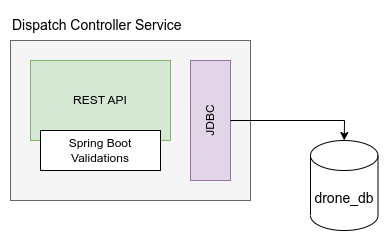
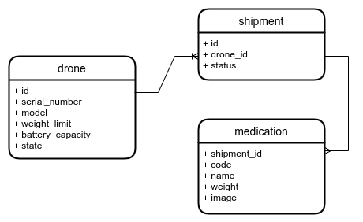

# Dispatch Controller

[](https://github.com/ayeshLK/dispatch-controller/actions/workflows/daily-build.yml)
[](https://github.com/ayeshLK/dispatch-controller/actions/workflows/trivy-scan.yml)

*Dispatch Controller* simulates a drone based medicine logistics management system. Clients can connect to the system and carry out necessary actions through the RESTful API provided by the `dispatch-controller-service`.

The application's top-level component diagram is shown below.



Following functional areas will be covered during the implementation of this project:
1. RESTful API development using Spring Boot
2. Spring Boot validations
3. Spring Boot database connectivity (via JDBC)
4. Spring Boot testing

An H2 in-memory database is utilized in this project to streamline the development process. The proposed structure of the database for the application is shown in the following ER diagram.



Project also contains a [Postman collection](_docs/dispatch-controller.postman_collection.json) which can be used to test the API.

## Prerequisites
- OpenJDK 17+
- Maven 3.8.5.+

## Build, Test, and Run ##

### Build Application ###

Execute the following command to build the application.
```shell
mvn clean install
```

### Test Application ###

Maven usually runs tests when we build the project. But, to run the tests separately, execute the following command.
```shell
mvn clean install
```

### Run Application ###

#### Run Locally ####

Once you build the project execute the following command to run the app locally.
```shell
java -jar dispatch-controller-service/target/dispatch-controller-service-0.0.1-SNAPSHOT.jar
```

#### Run a Docker Container ####

To build the docker container, execute the following command.
```shell
mvn compile jib:dockerBuild
```

To run the docker container, execute the following command.
```shell
docker run -p 9000:9000 -t -d dispatch-controller-service:0.0.1-SNAPSHOT
```
